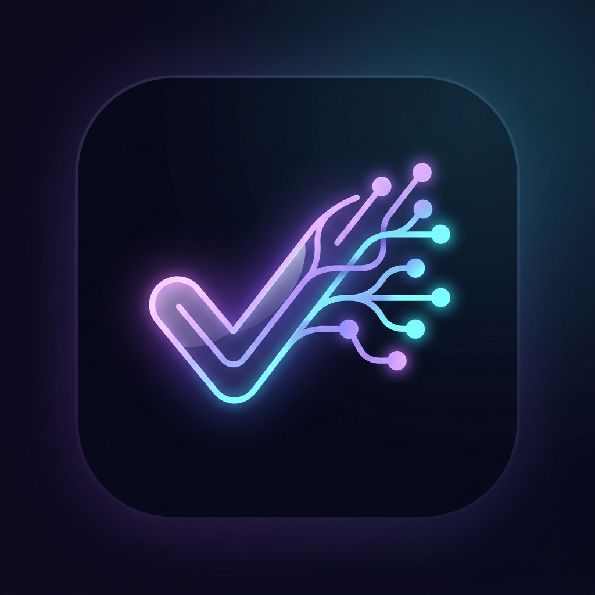
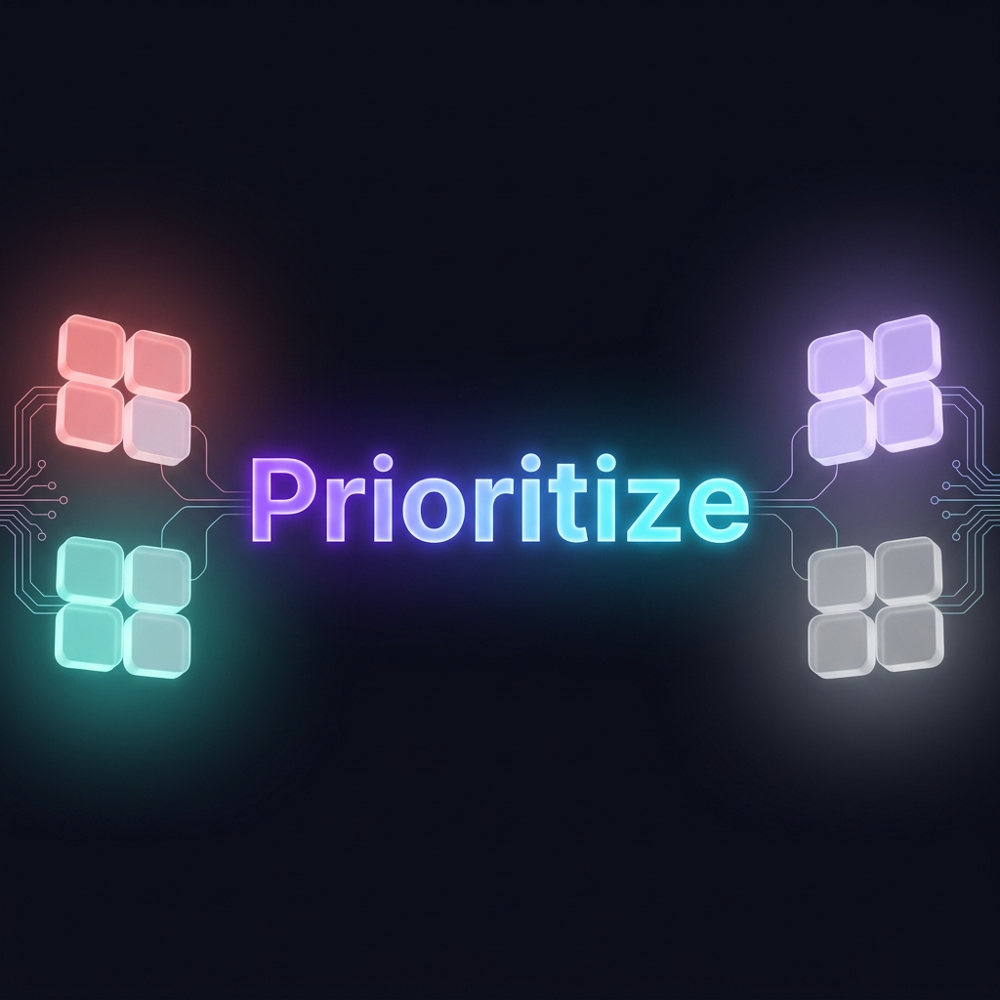
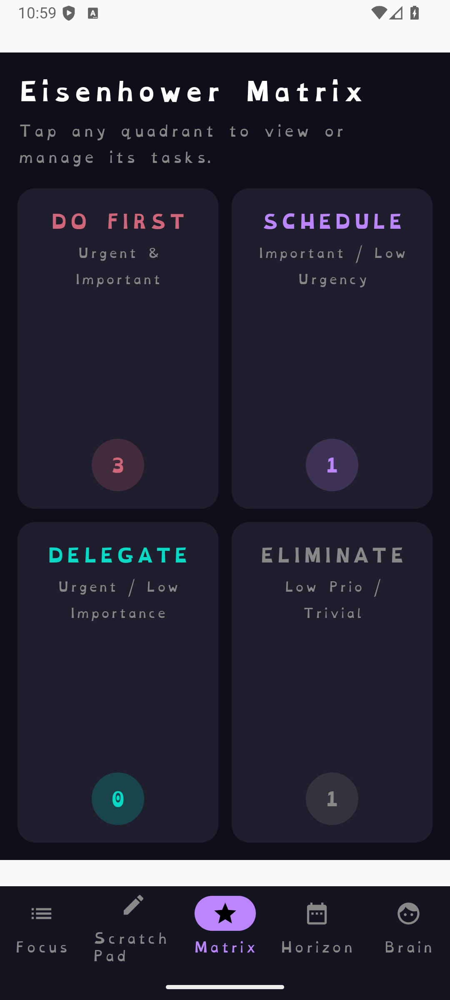
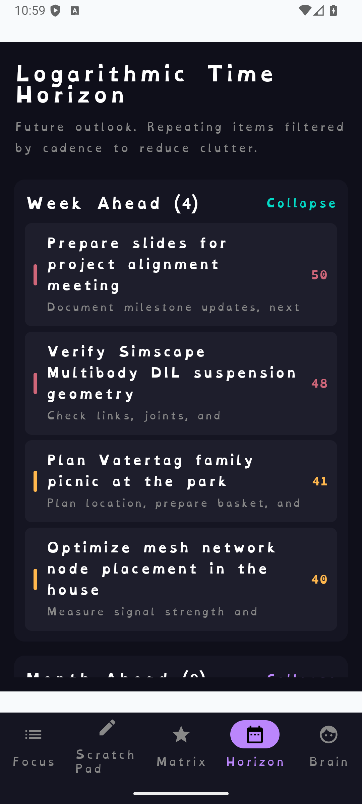
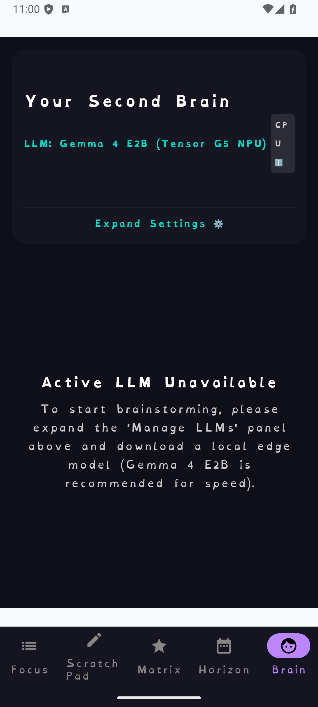

<div align="center">



# Prioritize

**A privacy-first, on-device AI task manager for Android**

*Your entire brain — the strategy, the chaos, the big picture — in your pocket. No cloud. No subscriptions. No data leaving your device.*

[](https://android.com)
[](https://kotlinlang.org)
[](https://developer.android.com/compose)
[](https://ai.google.dev/edge/litert)
[](LICENSE)



</div>

---

## ✨ Features

### 🎯 Focus Dashboard
Dynamically ranked task list using a composite priority score (importance × urgency × deadline pressure). Your top 3 tasks are always front and centre. No manual sorting needed.

### 🧠 Scratch Pad → AI Parsing
Dump any thought, voice-to-text note, or brain dump into the Scratch Pad. The on-device LLM extracts a structured task — title, importance (1–10), urgency (1–10), estimated duration, and deadline — and presents it for your confirmation before saving.

### ⚔️ Eisenhower Matrix
Four-quadrant view — **Do First / Schedule / Delegate / Eliminate** — automatically populated by task importance and urgency scores. No manual categorisation.

### 🌅 Horizon View (Logarithmic Time Planning)
A time-bucketed future outlook: *Week Ahead → Month Ahead → Quarter Ahead → Year & Beyond.* Deadlines and special dates surface automatically in the right bucket. Repeating tasks are filtered by cadence to reduce clutter.

### 🔬 Second Brain (AI Chat)
Conversational AI powered by a fully local LLM. The Brain has:
- **RAG-backed memory** — Executive Profile built through an onboarding interview, persisted across sessions
- **Web search tool** — The model can trigger a live web search when it needs external facts
- **Task injection** — Automatically suggests tasks from conversation context
- **Observation logging** — Passive insight capture that feeds the memory profile over time

### 🪓 Task Breakdown (Subtask Generation)
Tap the breakdown button on any task to have the AI decompose it into 3–5 tiny, low-friction sequential steps with time estimates. Subtasks are saved to the database and rendered as an inline checklist with completion tracking and time summation.

### 🔁 Repeating Tasks & Special Dates
Full recurrence engine (daily / weekly / monthly / yearly with interval and preferred day-of-week controls). Special date tracking for birthdays, anniversaries, and recurring care events with countdown display.

---

## 📸 Screenshots

| Focus Dashboard | Scratch Pad | Eisenhower Matrix |
|:---:|:---:|:---:|
|  |  |  |

| Horizon View | Second Brain |
|:---:|:---:|
|  |  |

---

## 🤖 Supported On-Device Models

Models are downloaded by the user and sideloaded onto the device. No cloud API is used.

| Model | Backend | Notes |
|:---|:---|:---|
| **Gemma 4 E2B (Tensor G5 NPU)** | NPU | Requires Pixel 10 Pro (Tensor G5). Fastest inference. |
| **Gemma 4 E2B (Thinking)** | CPU / GPU | Recommended general model. |
| **Gemma 4 E4B (Thinking)** | CPU / GPU | Higher quality, higher RAM requirement. |
| **Gemma 3n E2B** (Gated) | CPU / GPU | Requires HuggingFace access approval. |
| **Gemma 3n E4B** (Gated) | CPU / GPU | Requires HuggingFace access approval. |
| **Gemma 3 1B** | CPU / GPU | Lightweight option. |
| **Qwen 2.5 1.5B Instruct** | CPU / GPU | Fast, compact multilingual model. |
| **DeepSeek R1 Distill 1.5B** | CPU / GPU | Strong reasoning in small footprint. |
| **TinyGarden 270M** | CPU / GPU | Ultra-lightweight. |
| **MobileActions 270M (Tensor G5 NPU)** | NPU | Requires Pixel 10 Pro. Tool-calling specialist. |

> Models are loaded via **LiteRT-LM** with automatic NPU → GPU → CPU fallback cascade. A SharedPreferences-based crash guard prevents SIGABRT crashes from locking the app out of working backends on subsequent launches.

---

## 🏗️ Architecture

```
app/
├── ai/
│   ├── Gemma4Parser.kt          # LiteRT-LM engine lifecycle, NPU/GPU/CPU cascade, crash guard
│   ├── LiteRtUpdateChecker.kt   # Polls Google Maven for newer LiteRT-LM versions
│   └── TaskParser.kt            # Interface for all parsing operations
├── data/
│   ├── Task.kt / SubTask.kt     # Core Room entities
│   ├── TaskDao.kt               # All database queries
│   ├── TaskDatabase.kt          # Room DB, version 5, exportSchema = true
│   ├── Migrations.kt            # Explicit migrations v2→v3→v4→v5 (no destructive fallback)
│   └── TaskRepository.kt        # Single source of truth for data layer
├── ui/
│   ├── components/              # TaskCard, BreakdownDialog, ConfirmTaskDialog, ...
│   ├── screens/                 # FocusListScreen, MatrixScreen, HorizonScreen, BrainScreen, ...
│   └── viewmodel/
│       ├── TaskViewModel.kt     # Central ViewModel (~1100 lines), AI orchestration, RAG, chat
│       ├── ModelRegistry.kt     # Model catalogue with filenames, sizes, and backend hints
│       └── BackupManager.kt     # JSON export/import for task data
└── worker/
    ├── PriorityUpdateWorker.kt  # Background WorkManager job: recalculates priority scores
    └── DreamingWorker.kt        # Overnight background reflection and memory consolidation
```

**Key design decisions:**
- **Single resident model engine** — one `Engine` instance at a time to avoid OOM on 6–8 GB devices
- **BreakdownDialog hoisted to `MainDashboard`** — shared across all tabs, no duplication
- **`fallbackToDestructiveMigration()` is NOT used** — all schema changes have explicit SQL migrations
- **No cloud dependency** — all AI inference runs fully on-device via LiteRT-LM

---

## 🚀 Building & Running

### Prerequisites
- Android Studio Meerkat or newer
- Android SDK 35+
- A device with Android 12+ (API 31+)
- At least 6 GB RAM on device recommended for Gemma 4 E2B

### Build

```bash
git clone https://github.com/KoueKoffie-MW/prioritize-android.git
cd prioritize-android
./gradlew assembleDebug
```

### Install

```bash
# With a connected device and USB debugging enabled:
./gradlew installDebug
```

### Model Setup

1. Download a `.litertlm` model file (see supported models above)
2. Connect the device and push the file to the app's external files directory:
   ```bash
   adb push your_model.litertlm /sdcard/Android/data/com.example.prioritize/files/
   ```
3. Open the app → Brain tab → ⚙️ Settings → select the model

---

## 📦 Release

The latest release APK is available as [`PrioApp.zip`](PrioApp.zip) in the root of this repository.

---

## 📖 Documentation

- [`DOCS/adr/001-mobileactions-integration.md`](DOCS/adr/001-mobileactions-integration.md) — Architecture Decision Record for MobileActions integration
- [`DOCS/glossary.md`](DOCS/glossary.md) — Key technical terms

---

## 🛠️ Tech Stack

| Layer | Technology |
|:---|:---|
| Language | Kotlin |
| UI | Jetpack Compose |
| Architecture | MVVM + Repository pattern |
| Database | Room (SQLite) |
| AI Inference | LiteRT-LM (Google AI Edge) |
| Background Work | WorkManager |
| Async | Kotlin Coroutines + StateFlow |
| Build | Gradle (KTS) + KSP |

---

## 📄 License

MIT License — see [LICENSE](LICENSE) for details.
